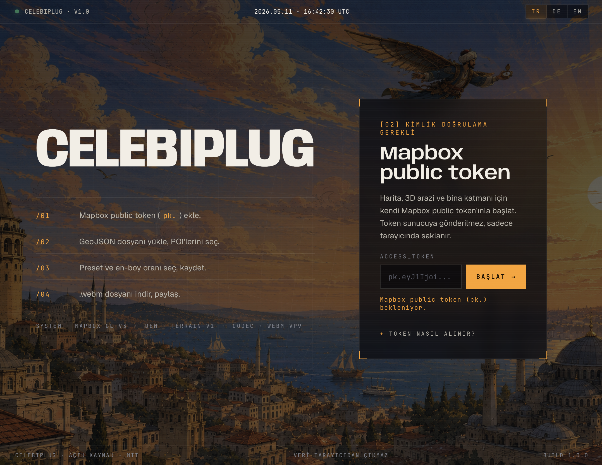
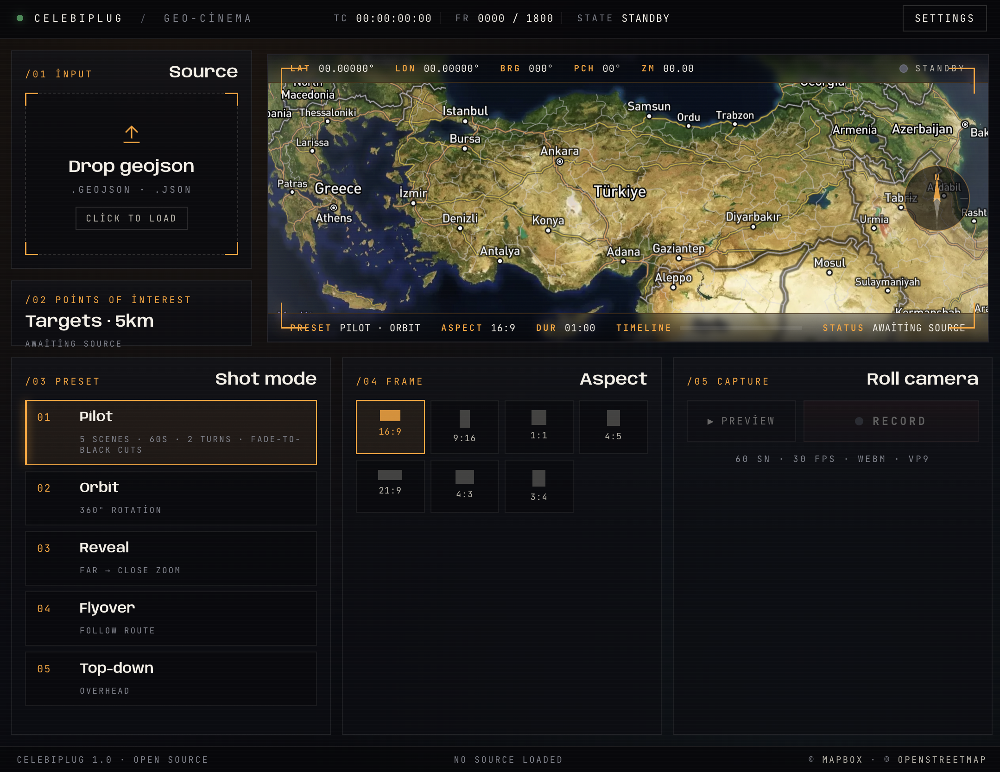
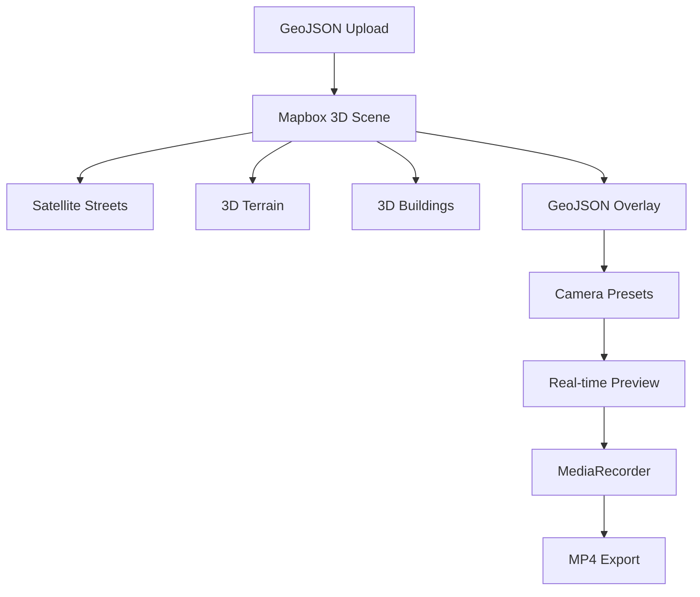

<p align="center">
  
</p>

<h1 align="center">CelebiPlug</h1>

<p align="center">
  <strong>Geo-cinema for GeoJSON.</strong><br/>
  Cinematic 3D drone shots directly from your browser — plus a local geo-intelligence API and CLI.
</p>

<p align="center">
  <a href="https://github.com/koksal-code/celebi-plug">Repository</a>
  ·
  <a href="https://github.com/koksal-code/celebi-plug/issues">Report Bug</a>
  ·
  <a href="https://github.com/koksal-code/celebi-plug/issues">Request Feature</a>
</p>

<p align="center">
  
  
  
  
</p>

---

<p align="center">
  
</p>

---

# Overview

CelebiPlug turns a place — a GeoJSON file, a search query, a map pin, or a drag-rectangle — into a cinematic 3D drone-style shot directly inside your browser.

It uses Mapbox satellite imagery, 3D terrain, 3D buildings, the Pilot cinematic preset, and the browser’s MediaRecorder API to export a **36- or 60-second MP4/H.264 video** at **30 fps**. Recording happens in a GUI browser with WebGL/GPU and MP4 encoder support; an agent can drive that browser by URL autopilot or the `window.celebiPlug` API.

- No server-side rendering
- No FFmpeg dependency
- One Mapbox public token to set up
- Agent-drivable end-to-end via a deep-link URL or a `window.celebiPlug` JS bridge

```text
GeoJSON dropped in
   │
   ├─► Mapbox 3D scene loaded
   │      satellite-streets-v12
   │      mapbox-terrain-dem-v1
   │      composite/building extrusions
   │
   ├─► Pilot preset rolls
   │      60s · 5 scenes · 2 rotations
   │      fade-to-black scene cuts
   │
    └─► celebi-plug-pilot-*.mp4
          12 Mbps · H.264
```

---

# Features

- 🌍 Mapbox satellite + 3D terrain + real-time 3D building extrusions
- 📂 Four input modes: drop a GeoJSON · search a place · drop a pin (click or paste lat/lon) · drag a bounding box on the map
- 🧭 Auto-tuned framing — radius scales from geocoder `place_type` (address → tight; city → wide)
- 🎯 Draggable corner handles on synthetic shapes — dial the framing without re-running search
- 🎬 Pilot cinematic preset, with a 60s default and a 36s sparse mode (no POI)
- 🎥 Browser-native MP4/H.264 recording at 12 Mbps, 30 fps
- 🌑 Fade-to-black scene transitions
- 🎞 Result modal — preview the take, download, or re-record with/without POIs
- 🤖 Agent autopilot — chat can open a GUI browser with `?q=...&poi=skip&autostart=1` or use the `window.celebiPlug` JS API
- 🚫 No server-side rendering, no token-handling endpoint
- 🌐 Turkish, German, and English onboarding
- 🧩 Geo-intelligence side modules — weather, news, aircraft, earthquakes, wildfires, public cameras — exposed as `/api/*` endpoints and a `celebi` CLI, all with free/open-data defaults

---

# Quick Start

```bash
git clone https://github.com/koksal-code/celebi-plug
cd celebi-plug

python3 -m venv .venv
source .venv/bin/activate

pip install -r requirements.txt
python3 app.py
```

Open:

```text
http://127.0.0.1:5001
```

**Agent / chat-native path** — no welcome screen needed. The agent collects your `pk.` token in chat, writes it to `.env`, and the studio opens pre-authenticated on the first load:

```bash
echo 'MAPBOX_TOKEN=pk.eyJ1...' > /path/to/celebi-plug/.env
```

**Manual path** — open `http://127.0.0.1:5001`, paste the token in the welcome screen, and the studio appears.

Grab a token at `https://account.mapbox.com` → Access tokens → default public token. The token starts with `pk.` — never use an `sk.` secret token. It is stored only in your browser’s `localStorage` and never sent to the server.

---

# Terminal Local Kurulum (Ajan'siz)

Bu akış tamamen terminal + local browser içindir.

1. Repoyu klonla:

```bash
git clone https://github.com/koksal-code/celebi-plug
cd celebi-plug
```

2. Python ortamını oluştur ve aktive et:

```bash
python3 -m venv .venv
source .venv/bin/activate
```

3. Bağımlılığı kur:

```bash
pip install -r requirements.txt
```

4. Mapbox public tokenını `.env` dosyasına yaz (`pk.` ile başlamalı):

```bash
echo 'MAPBOX_TOKEN=pk.eyJ1...' > .env
```

5. Uygulamayı başlat:

```bash
python3 app.py
```

6. Tarayıcıdan aç:

```text
http://127.0.0.1:5001
```

7. Kayıt al:
- Hedefini seç (File / Search / Pin / Box)
- Oranı seç (ör. `9:16`)
- İstersen POI seç
- `Preview` sonra `Record`

---

# GUI Runtime Requirement

CelebiPlug records only when the runtime has a GUI browser, GPU/WebGL, and MP4/H.264 support.

- Start `python3 app.py` and use `http://127.0.0.1:5001`.
- If GUI/GPU/MP4 checks fail: `GPU/GUI yok, Çelebi uçuş yapamaz. Kurulumu iptal ediyorum; kurulumdan kalan dosyaları sileyim mi?`
- Server-side recording is disabled; use the studio, autopilot URL, or `window.celebiPlug.record()`.

---

# Studio

| Welcome Screen | Recording Studio |
|---|---|
|  |  |

---

# How a Shot Is Made

## 1. Pick a Source

The left rail has four tabs — all feed the same downstream pipeline:

- **File** — drop a `.geojson` / `.json`. Polygons render as red 3D extrusions; lines and points as red highlights.
- **Search** — type a place name. The Mapbox geocoder resolves it; the radius auto-tunes from `place_type` (address → 30m, neighborhood → 100m, city → 600m). The R input lets you override.
- **Pin** — click anywhere on the map (auto-armed when you switch to this tab), or paste `lat, lon[, radius]`. A persistent draggable marker stays on the dropped pin.
- **Box** — drag a rectangle on the map; the bbox becomes the polygon.

For Search / Pin / Box, four amber **corner handles** appear on the synthetic square. Drag any corner to resize the framing without re-running the input.

---

## 2. (Optional) Pick up to 2 POIs

A 5 km Overpass scan lists nearby named POIs in the left rail. Mark up to two to make Pilot scenes 3 & 4 visit them. Skip it and Pilot uses synthetic offsets — or explicitly opt out in the agent flow for the 36-second sparse take.

---

## 3. Pick an Aspect Ratio

Seven aspects available — `16:9` · `9:16` · `1:1` · `4:5` · `21:9` · `4:3` · `3:4`. The viewfinder reshapes instantly; Mapbox resizes after recording-safe debounce.

---

## 4. Preview ↔ Record

Preview the camera path before committing. Click again to stop — preview is a single toggle button. Record locks aspect & preset, captures 60s (or 36s sparse), and pops the result modal.

---

## 5. Result Modal

After recording the take auto-plays in the modal. From here:

- **Download** — save the `.mp4`.
- **+ With POIs** — auto-pick the 2 closest POIs (if none selected) and re-record at 60s.
- **No POI · 36s** — clear POIs and re-record the sparse 3-scene Pilot.

Esc closes the modal and frees the blob URL.

---

# Cinematic Presets

The studio surfaces **Pilot** as the single visible preset. Four additional presets live in the codebase for agent use — pass them via `preset=` in the autopilot URL or `window.celebiPlug.setPreset(...)`.

## Pilot (default · UI)

| Mode | Trigger | Duration | Scenes | Notes |
|---|---|---|---|---|
| Full | default | 60s | 5 (center · close · POI1 · POI2 · return) | 720° rotation, fade-to-black between scenes |
| Sparse | `poi=skip` | 36s | 3 (center · close · return) | 1.2 turns, no POI dwell |

## Agent-only presets

| `preset=` | Move |
|---|---|
| `orbit`    | Single elegant 360° rotation with breathing pitch |
| `reveal`   | 3-beat keyframe arc, far → mid → close, pitch 18°→74° |
| `flyover`  | Follows the GeoJSON polyline with anticipation bearing |
| `top-down` | Half-rotation overhead descent, pitch 2°→30° |

All presets are pure functions of `t ∈ [0, 1]` returning `{ center, zoom, pitch, bearing }`. Pilot additionally emits `{ fade, polygonOpacity }`. Edit them in [`static/script.js`](static/script.js).

---

# Architecture



---

# Project Structure

```text
.
├── app.py                # Flask: studio route + /api/* geo-intel endpoints
├── cli.py                # argparse entrypoint
├── celebi                # bash wrapper that runs cli.py with the project python
├── legal_guard.py        # central source whitelist + record filters
├── providers/            # one tiny adapter per upstream
├── modules/              # provider selection + fallback chains
├── utils/                # urllib + geocode helpers (stdlib only)
├── requirements.txt
├── templates/index.html
├── static/script.js
├── static/style.css
├── static/onboarding.png
├── install.md
├── SKILL.md
├── AGENTS.md
├── README.md
└── LICENSE
```

The studio core (Mapbox 3D + MediaRecorder + Pilot preset + `window.celebiPlug`) is in `templates/index.html` + `static/script.js` and is **not touched** by the geo-intel modules.

---

# Geo-Intelligence Modules

Six modular providers ship alongside the studio. Every default is **token-free** (Open-Meteo, RSS, OpenSky, AFAD, Kandilli, NASA FIRMS, OpenStreetMap Nominatim). Bring your own token only when you want to switch providers.

| Module | Default (free) | Optional | Switch via |
|---|---|---|---|
| Weather | Open-Meteo | OpenWeather | `CELEBI_WEATHER_PROVIDER=openweather` + `OPENWEATHER_API_KEY` |
| News | RSS (TRT · Hürriyet · NTV · BBC · Reuters) | NewsAPI | `CELEBI_NEWS_PROVIDER=newsapi` + `NEWSAPI_KEY` |
| Aircraft | OpenSky | ADS-B.lol | `CELEBI_AIRCRAFT_PROVIDER=adsb-lol` |
| Earthquakes | AFAD → Kandilli → USGS | — | `CELEBI_EARTHQUAKE_PROVIDERS=usgs,afad` |
| Wildfires | NASA FIRMS (MODIS 24h CSV) | — | optional `FIRMS_MAP_KEY` |
| Cameras | Curated public registry (KGM, Fethiye, IBB, Uludağ MP) | — | (add entries in [`providers/cameras.py`](providers/cameras.py)) |

All modules pass through [`legal_guard.py`](legal_guard.py), which:

- whitelists every source with its license tag
- drops aircraft with military callsign prefixes (RCH, SAM, GAF, TURAF, NATO…) and PIA/LADD opt-outs
- refuses MOBESE / KGYS / surveillance cameras and any source matching forbidden tokens

---

# Local API

The Flask process binds to `127.0.0.1:5001` and only accepts loopback requests.

```text
GET /health
GET /api/weather?q=Fethiye               # or ?lat=36.65&lon=29.12 [&marine=1]
GET /api/news?q=Antalya&limit=10
GET /api/aircraft?callsign=TK1923        # or ?lat=&lon=&radius_km=
GET /api/earthquakes?min=2&limit=20
GET /api/wildfires?q=Manavgat            # or ?bbox=west,south,east,north
GET /api/cameras?q=Fethiye&radius_km=50  # or ?lat=&lon=
```

Sample:

```bash
curl 'http://127.0.0.1:5001/api/weather?q=Fethiye&marine=1'
curl 'http://127.0.0.1:5001/api/earthquakes?min=3'
```

---

# CLI

`./celebi` is a one-line bash wrapper around `cli.py`. It prefers an activated virtualenv, falls back to `.venv/bin/python`, then to `python3`.

```bash
./celebi weather "Fethiye"                  # Open-Meteo via Nominatim
./celebi weather --lat 36.65 --lon 29.12 --marine
./celebi news "Antalya" --limit 10
./celebi aircraft TK1923
./celebi aircraft --place "Fethiye" --radius-km 80
./celebi earthquake --min 3
./celebi wildfire --place "Manavgat"
./celebi cameras "Fethiye"

# Artifact delivery — files, not links
./celebi snap-aircraft TK1923                       # PNG composite (Mapbox satellite + pin + info card)
./celebi snap-camera "Fethiye"                      # one-frame PNG (real JPEG if registry has it, else satellite fallback)
./celebi film "Fethiye Ölüdeniz" --aspect 9-16      # full cinematic MP4 via the studio autopilot
./celebi film "Fethiye" --narrate auto              # MP4 with TTS narration baked in (no ffmpeg)
./celebi narrate --place "Fethiye" --lang tr        # standalone narration text + .m4a/.wav file
```

Add the project root to your `PATH` (or symlink `celebi` into `~/.local/bin/`) to drop the `./` prefix.

`snap-aircraft` and `snap-camera` deliver a satellite still + JSON sidecar by default. Install **Pillow** (`pip install Pillow`) to bake the metadata into the PNG as an orange-bracket info card — the same visual language as the studio HUD.

`film` drives the existing studio recorder (no headless workaround, no ffmpeg) — it opens a real GUI Chrome at the autopilot URL, polls `~/Downloads` for the `celebi-plug-*.mp4`, and returns the path so the agent can attach it to chat directly.

The CLI prints JSON to stdout — pipe it through `jq` for human reading.

---

# Agent Autopilot

The studio exposes two non-UI control surfaces so a browser-automation agent can drive a shot end-to-end without clicking. The Mapbox token must be available — either pre-loaded into `.env` (chat-native, recommended) or previously saved via the welcome screen.

## Deep-link URL

```bash
open "http://127.0.0.1:5001/?q=<URL_ENCODED_PLACE>&preset=showcase&aspect=9-16&poi=skip&autostart=1"
```

| Param | Notes |
|---|---|
| `q=` | place name; geocoded in-page. Auto-tunes radius from `place_type` if `radius=` omitted. |
| `lat=`, `lon=` | coordinate pair; uses `radius` (default 60m). |
| `preset=` | `showcase` (default Pilot) · `orbit` · `reveal` · `flyover` · `top-down`. |
| `aspect=` | `16-9` · `9-16` · `1-1` · `4-5` · `21-9` · `4-3` · `3-4`. |
| `radius=` | meters; overrides auto-tune. |
| `poi=` | `skip` (no POIs · 36s sparse) · `auto` or `auto:N` · `names:A,B`. |
| `autostart=1` | wait for tiles, record, download — no result modal. |

Agent recordings should keep the browser visible. If Chrome is launched by automation, disable background throttling and verify the MP4 duration before reporting success.

Never put the Mapbox token in the **query string**. The hash fragment `#token=pk.XXX` is safe (browsers don't transmit hash to the server) and can be used for first-run bootstrap when `.env` isn't an option:

```bash
open "http://127.0.0.1:5001/?q=<URL_ENCODED_PLACE>&aspect=9-16&poi=skip&autostart=1#token=pk.XXX"
```

## JS bridge

```js
await window.celebiPlug.loadCoordinates([28.9784, 41.0082], 80);
await window.celebiPlug.search("USER_REQUESTED_PLACE", { autoTune: true });
window.celebiPlug.setPreset("orbit");
window.celebiPlug.setAspect("9-16");
window.celebiPlug.autoPickPois(2);             // closest two
window.celebiPlug.setSkipPoiScenes(false);     // toggle the 36s sparse mode
const blob = await window.celebiPlug.record(); // downloads + returns Blob
```

Other methods: `isReady()`, `getState()`, `getPois()`, `selectPois([0,1])`, `pickPoisByNames(["camii"])`, `clearPois()`, `preview()`, `stopPreview()`, `loadBbox([w,s,e,n])`, `armPinPick()`, `armBboxDraw()`, `selectSourceTab("upload"|"search"|"pin"|"box")`.

## Agent-friendly docs

- [`SKILL.md`](SKILL.md) — day-to-day usage, conversation pattern, command vocabulary (e.g. *"etrafında dön" → `preset=orbit`*), and Overpass POI listing snippet.
- [`install.md`](install.md) — first-time install for LLMs to execute.
- [`AGENTS.md`](AGENTS.md) — code priorities at a glance.

Register `SKILL.md` with your agent using your agent tool's local skill-registration flow.

---

# Languages

The onboarding ships in:

```text
Turkish · German · English
```

Pick from the:

```text
TR · DE · EN
```

switcher in the top-right of the welcome screen.

The choice persists in `localStorage` under:

```text
celebi-plug_lang
```

---

# Why CelebiPlug?

Most map-video pipelines require:

- server-side rendering
- FFmpeg orchestration
- heavy GPU infrastructure
- complex export pipelines

CelebiPlug keeps the workflow lightweight.

Drop GeoJSON.  
Preview the move.  
Record directly from the browser.  
Export cinema.

---

# License

MIT

---

<p align="center">
  Built for geo-cinematic experimentation.
</p>

<p align="center">
  Inspired by drone cinematography, GIS tooling, and browser-native graphics.
</p>
